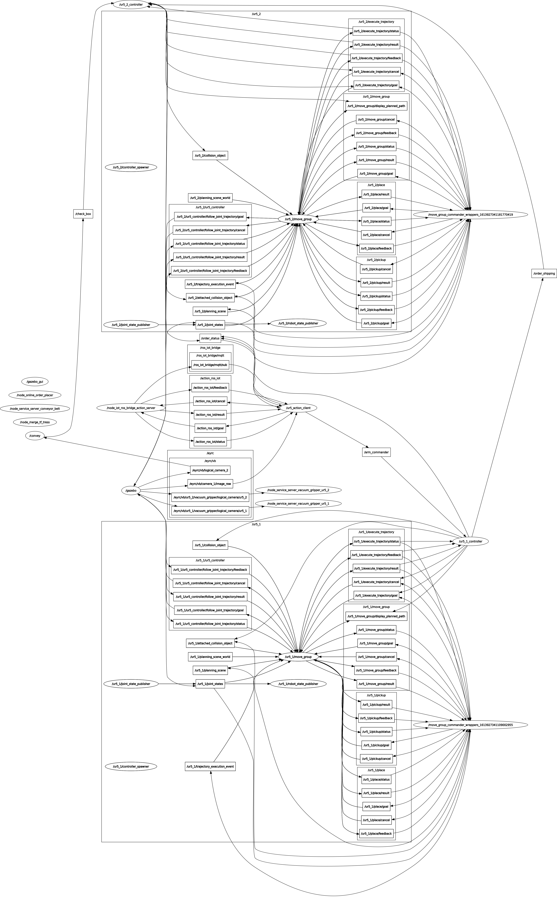

Implementation
==============
We are using 5 nodes including node_action_server_ros_iot_bridge.

*Getting Orders*:

Orders are being published in the mqtt topic **"/eyrc/vb/axaKcGsN/orders"**. ROS-IoT Bridge Action Server subscribes to that topic and receives the message. 
The orders are then published on the topic **"/ros_iot_bridge/mqtt/sub"**  and a list of all orders is also prepared in this node. The node **"ur5_action_client"** which acts as the action client, subscribes to the topic **"/ros_iot_bridge/mqtt/sub"**.

*Inventory*:

The ur5_action_client takes picture from the 2d camera using openCV. The picture is sliced and the colour of the box is detected by reading the qr code using pyzbar librairy. The colours are stored in a list serially. The inventory is sent to the ROS-IoT Bridge as a goal, which is published to the google sheet's Inventory sheet using http requests.

The callback function which subscribes to the topic **"/ros_iot_bridge/mqtt/sub"** checks if the box of required colour is present in the inventory or not. If the required box is present, its colour, position on the shelf and the order id is published to the topic **"/arm_commander"**, else it prints the message that inventory is empty.

*Dispatching*:

The topic **"/arm_commander"** is subscribed by the node **"ur5_1_controller"**. This node **"ur5_1_controller"** controls the **ur5_1** arm. When a message is received on the **"/arm_commander"** topic, it is stored in a tuple(tup_order) in which the orders are sorted according to priority. The arm picks up that box, that is on the first index of tup_order and places it on the conveyor belt. After dispatching the box, the first element of tup_order is deleted and its order id and the message dispatched is publlished on the topic **"/order_status"**. The order id and the box's colour is also published on the topic **"/order_shipping"**.

*Conveyor*:

The node **"convey"** controls the conveyor. It starts the conveyor at full speed. When the dispatched box comes under the logical_camera, it stops the conveyor, publishes a messag on the topic **"/check_box"**, which contains the serial no. of dispatched box and the word True. After the box is picked by the ur5_2 arm, it starts the conveyor again.

*Shipping*:

The node **"ur5_2_controller"** controls the **ur5_2** arm. It subscribes to the topics **"/check_box"** and **"/order_shipping"**. When it gets a message from the topic **"/check_box"**, the arm picks up the box and drops it to a bin, whose colour is received from the topic **"/order_shipping"**. After the box is dropped in its bin, it publishes the order id and the message shipped on the topic **"/order_status"**.

*Publishing in google sheets*:

The action client **ur5_action_client**, subscribes to the topic **"/order_status"**. When it receives a dispatched or shipped message it sends the order id to the ROS-IoT Bridge as a goal through their corresponding goal modes.

After the ROS-IoT Bridge receives goals, it searches the order having the order id that is sent as goal. Then it publishes the details of the order that is dispatched or shipped to its corresponding google sheet using http requests.

The Dashboard gets data from the other sheets using google sheet functions. Emails are sent whenever the package is dispatched or shipped using google apps script taking data from the Dashboard. 

*Google spreadsheet link*:
https://docs.google.com/spreadsheets/d/1xLWA5cSzPCifhPsfZ_zSdPj_PTIcN5w4fCODogjbhng/edit?usp=sharing

*Dynamic Dashboard Link*:
https://eyrcvb1844.github.io/VB-1844_Warehouse_Dashboard/

    *rqt_graph*
